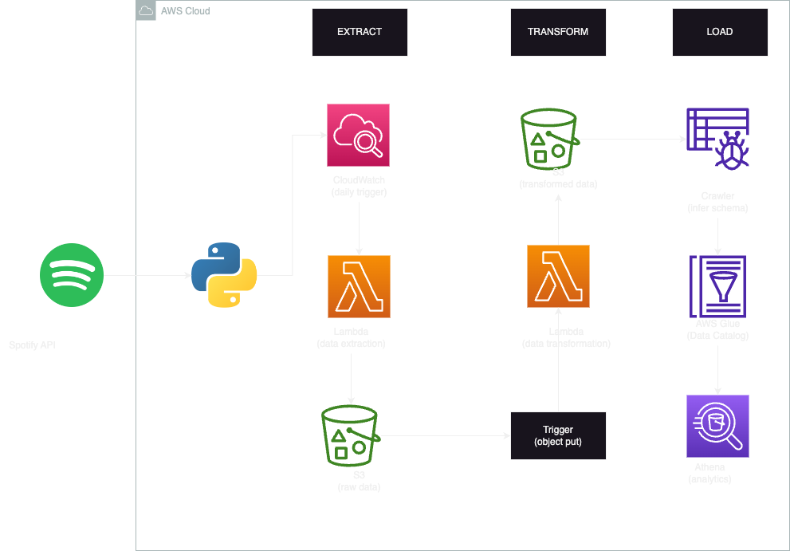
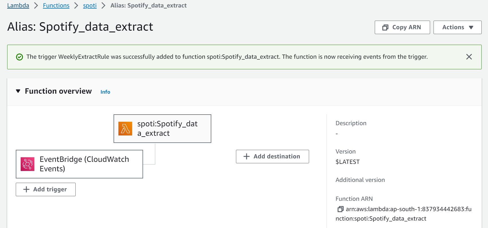
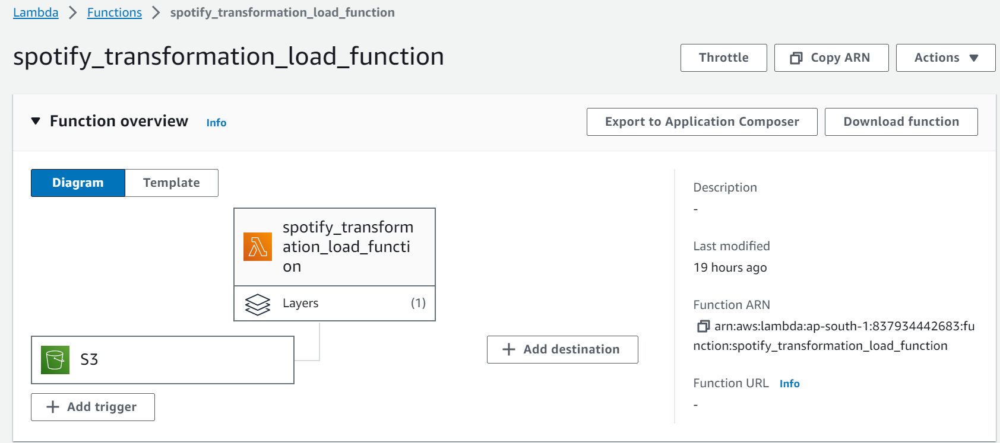
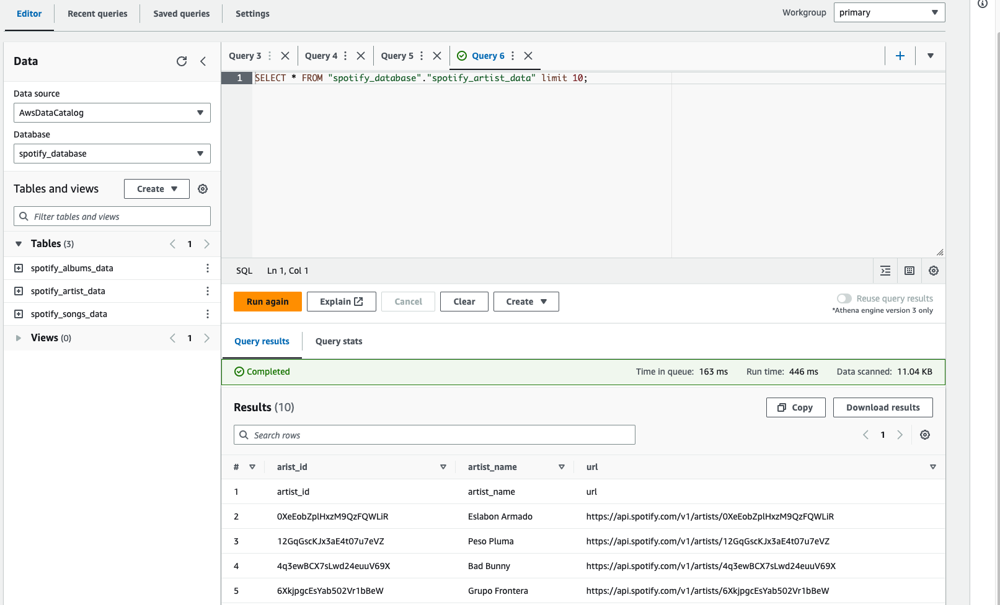

# Spotify-End-to-End-Data-Engineering-Project

## Project Overview

This end-to-end data engineering project involves

• **Spotify API Integration:** Extract data seamlessly from Spotify using the Spotify API.

• **Serverless Deployment:** Leverage AWS Lambda for efficient and scalable data extraction code deployment.

• **Automation Triggers:** Set up EventBridge and s3 Event trigger for automatic execution, ensuring timely and consistent data updates.

• **Transformation Logic:** Develop a robust transformation function for processing the extracted data effectively.

• **Data Analytics Infrastructure:** Store and organize data files on Amazon S3, then build analytics tables using AWS Glue and Athena for insightful analysis.

## Architecture Diagram

 **The architecture diagram highlights and breaks down the ETL pipeline into different stages:**

 • We access the Spotify API and use Python to extract data from the API to build our pipeline.

 • We use AWS Cloudwatch to have a daily trigger which it is then extracted on AWS Lambda.

 • The extracted data is stored on a bucket in AWS S3.

 • The raw extracted data on S3 is placed on AWS Lambda once again and is transformed by the Lambda function and stored on S3.

 • The transformed data is crawled by AWS glue and can be accessed and used for data analytics on AWS Athena.

## Services Used

• **Amazon S3 (Simple Storage Service):** is a highly scalable object storage service that can store and retrieve any data anywhere on the web. It is commonly used to store and distribute large media files, data backups, and static website files.

• **AWS Lambda:** is a serverless computing service that lets you run your code without managing servers. You can use Lambda to run code responding to events like changes in S3, DynamoDB, or other AWS services.

• **AWS EventBridge:** is a fully managed event bus service that makes it easy to connect different applications using events. It enables event-driven architectures by simplifying the process of ingesting, filtering, transforming, and delivering events so that you can build real-time applications with ease.

• **AWS Glue Crawler:** is a fully managed service that automatically crawls your data sources, identifies data formats, and infers schemas to create an AWS Glue Data Catalog.

• **AWS Glue Data Catalog:** is a fully managed metadata repository that makes it easy to discover and manage data in AWS. You can use the Glue Data Catalog with other AWS services, such as Athena.

• **Amazon Athena:** is an interactive query service that makes it easy to analyze data in Amazon S3 using standard SQL. You can use Athena to analyze data in your Glue Data Catalog or in other S3 buckets.

 
## Project Execution Flow

**Step-1:** Create S3 Bucket and Folder Structure

**1.1. Bucket Creation:** Create an S3 bucket named spotify-etl-project-demo.

**1.2. Folder Structure:** Inside the bucket, create the following folders

1. raw_data
   
    • to_process
   
    • processed
3. transformed_data
   
    • artist_data
   
    • album_data
   
    • song_data

**Step-2:** Lambda Function for Data Extraction (spotify_api_data_extract)

**2.1. Function Creation:** Create an AWS Lambda function named spotify_api_data_extract using an appropriate Python runtime (e.g., Python 3.8+).

**2.2. Dependencies:** Ensure the required packages, including spotipy, are available in the function's environment. Use AWS Custom Lambda Layers upload ``Spotipy_layer.zip`` Zip file.

**2.3. Code Implementation:** Add the data extraction code ``spotify_api_data_extract.py`` to the the Lambda function. This code should interact with the Spotify API and store raw data in the raw_data/to_process/ folder in the S3 bucket.

**Step-3:** S3 Bucket for Raw and Transformed Data

**3.1. Bucket Management:** The S3 bucket (spotify-etl-project-demo) will manage raw and processed data. 
Create subfolders as specified in the project overview: raw_data/processed/, raw_data/to_process/, transformed_data/artist_data/, transformed_data/album_data/, transformed_data/song_data/.

**Step-4:** Amazon EventBridge

4.1. EventBridge Rule: Create an EventBridge Rule to trigger the spotify_api_data_extract Lambda function at a scheduled interval (e.g., daily or weekly).

**Step-5:** Lambda Function for Data Transformation ``spotify_transformation_load_function.py``

**5.1. Function Creation:** Create an AWS Lambda function named spotify_transformation_load_function using an appropriate Python runtime (e.g., Python 3.8+).

**5.2. Dependencies:** Add the AWSSDKPandas-Python38 AWS Lambda Layer to provide access to the Pandas package.

**5.3. Code Implementation:** Add the data transformation code to the lambda_function.py file within the Lambda function.This code should process data from raw_data/to_process/, transform it, and store the results in the appropriate folders in transformed_data/. It should also move processed data to raw_data/processed/.

**Step-6:** AWS Glue Crawler & Athena

**6.1. Crawler Setup:** Create Glue Crawlers to infer the schema of transformed data in transformed_data/artist_data/, transformed_data/album_data/, transformed_data/song_data/.
Specify the S3 data folders as the data source for each crawler.

**6.2. Cataloging:** Allow the crawlers to store metadata in the Glue Data Catalog, creating tables based on inferred schema.

**Step-7:** Query Data Using Athena

**7.1. Athena Queries:** Use Amazon Athena to query the structured data stored in the Glue Data Catalog. Write SQL queries to analyze and derive insights from the transformed data.

**Additional Considerations:**

**1. Lambda Triggers:** Ensure Lambda triggers are properly configured based on the project overview.

**2. Security and Permissions:** Set up appropriate IAM roles and permissions for Lambda functions to access S3, EventBridge, Glue, and Athena.

**3. Monitoring and Logging:** Implement logging within Lambda functions for error tracking and monitoring.

**4. Testing:** Perform thorough testing of each component to ensure proper functioning at every stage of the pipeline.

## Conclusion

In summary, this data engineering project seamlessly integrates with the Spotify API, leveraging AWS services for automated ETL processes. By deploying Lambda functions, orchestrating triggers, and utilizing Glue and Athena, the pipeline ensures efficient data extraction, transformation, and analysis. Beyond data processing, the groundwork is laid for advanced analytics and dashboard creation, offering users a powerful platform to derive meaningful insights from Spotify data. The project showcases the power of AWS cloud services in building scalable and automated solutions for handling diverse datasets, providing a foundation for future enhancements.
